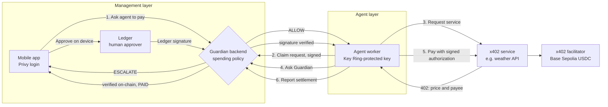

# Chapter 2

> **The control layer for AI agents that spend money.**
> *"AI agents can manage your treasury. Chapter 2 makes sure they never manage to control it."*

AI agents can now pay for APIs and services by themselves with [x402](https://x402.org), the internet-native payment protocol. That's only useful to a company if it can trust the agent with money.

Chapter 2 lets a company give its AI agent a spending budget and let it buy services on its own, while a human stays in control of anything that matters. Every payment the agent wants to make goes through the **Chapter 2 Guardian** first:

- **ALLOW:** small payments to approved services. The agent pays by itself.
- **ESCALATE:** larger payments. A human approves them on their **Ledger**.
- **BLOCK:** unapproved services. The payment never happens; no signature is ever created.

Payments are real USDC on Base Sepolia, settled through the public x402 facilitator and verified on-chain.

## How it works: two layers

### Management layer (the humans)
- **Chapter 2 mobile app:**
  - Sign in with Google through **Privy**.
  - Bind your company's agent.
  - Browse and search paid services.
  - Ask the agent to buy one.
  - Approve or reject big payments on your **Ledger** over Bluetooth.
  - See every decision in the activity feed.
- **Guardian backend:**
  - Applies the spending policy (approved services, per-payment limit, daily limit).
  - Queues purchase requests.
  - Accepts an approval only if it was signed by the company's Ledger.
  - Verifies every settlement on-chain.
- **Ledger device:** the human approver's key. Big payments can't move without it. A web console over WebHID is also available.

### Agent layer (the AI agent)
- **Agent worker:** runs on the agent's own machine. Its wallet key is protected by the **Ledger Key Ring** (`wallet-cli ring`) and never leaves that machine.
- **x402 payments:** the agent pays services in USDC, using signed payment authorizations (EIP-3009) settled by the x402 facilitator.

### How the layers connect

1. **The user asks.** In the app, the operator picks a service (say, a weather API) and taps **Ask agent to pay**. That creates a purchase request.
2. **The agent picks it up.** The agent worker claims the request, authenticating with a signature from its own key.
3. **The service names its price.** The agent calls the service, which answers `402 Payment Required` with the price and payee.
4. **The Guardian decides.**
   - **ALLOW:** the agent signs the payment itself.
   - **ESCALATE:** the payment appears in the app, and the human signs it on the Ledger. The backend checks that the signature comes from the company's Ledger before the agent can use it.
   - **BLOCK:** nothing is signed.
5. **The agent pays.** It retries the call with the signed payment. The x402 facilitator settles the USDC transfer on Base Sepolia.
6. **The backend verifies.** It reads the USDC transfer on-chain, and the app shows the purchase as paid, with the transaction and the data the service returned.

**Trust boundaries:**
- The backend holds no signing keys.
- The agent's key never leaves the agent's machine.
- Only the Ledger can approve an escalated payment.
- A payment counts as paid only once the transfer is verified on-chain.

## Partners

| Partner | What it does in Chapter 2 | Details |
|---|---|---|
| **Ledger** | Key Ring protects the agent's wallet key. Humans approve big payments on the device (mobile Bluetooth and web WebHID). The backend only accepts Ledger-signed approvals. | [docs/partners/ledger](docs/partners/ledger) |
| **Privy** | Google sign-in and an embedded EVM wallet for every user. Server-side token verification scopes agents, purchases and approvals to the right account. | [docs/partners/privy](docs/partners/privy) |
| **World** | World ID Selfie Check proves a real, unique human stands behind the approver. The verification service is built; the approval gate waits on World granting access. | [docs/partners/world](docs/partners/world) |

## Project status

- **Live on Base Sepolia:** the Guardian backend, x402 services and service discovery on [chapter2-backend.onrender.com](https://chapter2-backend.onrender.com/discovery/resources).
- **Built and tested:**
  - the mobile app: Services, Ledger approvals, activity;
  - the agent worker with the Ledger Key Ring;
  - Ledger approvals over Bluetooth and WebHID;
  - the purchase request queue.
- **In progress:**
  - live Ledger device testing with a remote tester;
  - the World ID approval gate, pending World's Selfie Check access (see [docs/world-id-approval-gate.md](docs/world-id-approval-gate.md)).

## For developers

- **Run it locally, environment, testing without a Ledger, security model:** [docs/development.md](docs/development.md)
- **Feature docs:** [docs/features](docs/features)
- **Demo video script:** [docs/demo-script.md](docs/demo-script.md)
- **Ledger developer experience feedback:** [docs/ledger-dx-feedback.md](docs/ledger-dx-feedback.md)

| Folder | Contents |
|---|---|
| `chapter2/` | Flutter mobile app (management layer) |
| `backend/` | NestJS Guardian backend, x402 services and purchase requests |
| `scripts/` | Agent worker and x402 demo client (agent layer) |
| `approval-console/` | Ledger WebHID approval console |
| `contracts/` | Foundry contracts (`Chapter2Guard`) |
| `docs/` | Partner pages, feature docs, tickets |
