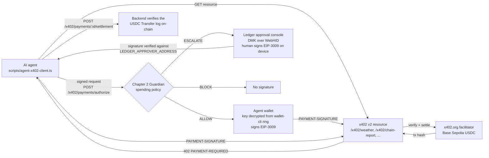

# Chapter 2

> **AI Guardian for Autonomous Treasuries**
> *"AI agents can manage your treasury. Chapter 2 makes sure they never manage to control it."*

AI agents can now pay for APIs by themselves with [x402](https://x402.org). Chapter 2 is the missing control layer: every payment an agent wants to make is evaluated by the **Chapter 2 Guardian** before any signature exists.

- **ALLOW:** small payments to approved payees are signed by the agent's own wallet. That wallet's key is encrypted with the **Ledger Key Ring** (`wallet-cli ring`).
- **ESCALATE:** larger payments are signed by a human **on their Ledger** (Nano X / Flex).
- **BLOCK:** anything else is refused, so no signature is ever produced.

Settlement happens on Base Sepolia USDC through the public x402 facilitator, and the backend verifies every transfer on-chain.

## Architecture



## How Ledger is used

1. **`wallet-cli ring` protects the agent's payment key.**
   - The agent's private key is encrypted under a Key Ring provisioned with the user's Ledger (`wallet-cli ring init` / `ring encrypt`).
   - At startup the agent runs `wallet-cli ring decrypt` and holds the key in memory only.
   - The key is never written to disk in plaintext, logged, or sent to the backend. See [`scripts/lib/ledger-key-ring.ts`](scripts/lib/ledger-key-ring.ts).
2. **Human-in-the-loop signing on the device.**
   - Escalated payments appear in the [approval console](approval-console/), a web app using Ledger's Device Management Kit over WebHID.
   - The human reviews the resource, amount, payee, Guardian risk score and reasons, then signs the USDC `TransferWithAuthorization` (EIP-3009) on their Nano X / Flex.
   - The payment is then made **from the Ledger address**.
3. **The backend only trusts the Ledger.**
   - `POST /x402/approvals/:id/signature` and `/reject` accept a signature only if it recovers to `LEDGER_APPROVER_ADDRESS`.
   - An escalation can't be approved by anyone who merely reaches the API.

Details: [`docs/features/x402-ledger-agent-payments.md`](docs/features/x402-ledger-agent-payments.md) · Ledger developer experience notes: [`docs/ledger-dx-feedback.md`](docs/ledger-dx-feedback.md)

## Run the demo locally

### Prerequisites
- Node 20+, Docker (for Postgres), Foundry (`cast`), `jq`
- `wallet-cli` (`npm i -g @ledgerhq/wallet-cli`)
- Chrome or Edge (WebHID)
- A Ledger Nano X or Flex with the Ethereum app
- Base Sepolia USDC from [faucet.circle.com](https://faucet.circle.com), for **both** the agent address and the Ledger address. No ETH is needed, because the facilitator pays gas.

### 1. Provision the Key Ring-protected agent wallet (once)

```bash
security add-generic-password -a default -s ledger-wallet-cli -w
WALLET_PASS=$(security find-generic-password -a default -s ledger-wallet-cli -w) wallet-cli ring init
mkdir -p ~/.chapter2
cast wallet new --json | jq -r '.[0].private_key' | \
  WALLET_PASS=$(security find-generic-password -a default -s ledger-wallet-cli -w) \
  wallet-cli ring encrypt -o ~/.chapter2/agent-key.enc --key chapter2-x402-agent
npm --prefix scripts install
WALLET_PASS=$(security find-generic-password -a default -s ledger-wallet-cli -w) \
AGENT_KEY_RING_FILE=~/.chapter2/agent-key.enc AGENT_KEY_RING_KEY_NAME=chapter2-x402-agent \
npm --prefix scripts run agent:address
```

The first command prompts for the ring password, and `ring init` needs approval on the device. The last command prints the agent address; fund it with USDC.

### 2. Configure and start the backend

```bash
docker compose up -d postgres
cd backend && cp .env.example .env && npm install
npm run start:dev
```

The x402 variables below are required: the backend refuses to start if one is missing. The Privy credentials are needed to bind the agent in step 3.

| Variable | Value / meaning |
|---|---|
| `X402_NETWORK` | `eip155:84532` (Base Sepolia) |
| `X402_FACILITATOR_URL` | `https://x402.org/facilitator` |
| `USDC_ADDRESS` | `0x036CbD53842c5426634e7929541eC2318f3dCF7e` |
| `X402_PAY_TO_ADDRESS` | Seller wallet that receives payments (a fresh address, not the agent or the Ledger) |
| `X402_PARTNER_PAY_TO_ADDRESS` | A second seller address that is **not** approved (used to demo BLOCK) |
| `X402_APPROVED_PAY_TO` | Comma-separated approved payees; includes `X402_PAY_TO_ADDRESS`, excludes the partner address |
| `X402_AUTONOMOUS_LIMIT` | Per-payment autonomous cap in USDC atomic units, e.g. `1000000` ($1.00) |
| `X402_DAILY_LIMIT` | Daily autonomous cap in atomic units, e.g. `5000000` ($5.00) |
| `LEDGER_APPROVER_ADDRESS` | Your Ledger's Ethereum address (`44'/60'/0'/0/0`) |
| `PUBLIC_BASE_URL` | e.g. `http://localhost:3001` |
| `PRIVY_APP_ID`, `PRIVY_APP_SECRET` | Privy app credentials. Without them every bearer token is rejected, so the agent can't be bound |

### 3. Bind the agent to your Chapter 2 user

The payments API only accepts requests signed by an `ACTIVE` bound agent. Bind yours with the mobile app's **Add Agent** sheet, or call the API with your Privy bearer token:

```bash
curl -X POST http://localhost:3001/agents/bind \
  -H "Authorization: Bearer $PRIVY_TOKEN" -H 'Content-Type: application/json' \
  -d '{"agentAddress":"<agent address>","name":"x402 agent","safeAddress":"0x4f712dd78Cb1a504C69CB4f68B82Fddb6b3b1df6","guardAddress":"0x9b6023D1B6D3b076C8d999Ba406AE486750ce7d3","chainId":84532}'
```

### 4. Start the Ledger approval console

```bash
cd approval-console && cp .env.example .env && npm install
npm run dev
```

Open it in Chrome or Edge and click **Connect Ledger**. Keep the device unlocked with the Ethereum app open. The console checks that the device address matches `LEDGER_APPROVER_ADDRESS`.

### 5. Run the agent

```bash
WALLET_PASS=$(security find-generic-password -a default -s ledger-wallet-cli -w) \
AGENT_KEY_RING_FILE=~/.chapter2/agent-key.enc \
AGENT_KEY_RING_KEY_NAME=chapter2-x402-agent \
API_BASE_URL=http://localhost:3001 \
npm --prefix scripts run demo:x402
```

Pass `-- --scenario=allow|escalate|block` to run a single scenario:
- **allow:** `$0.01` weather, paid by the agent wallet.
- **escalate:** `$2.00` chain report. Approve it in the console on your Ledger within 15 minutes.
- **block:** a partner feed with an unapproved payee; no signature is made.

Demo video plan and pre-submission checklist: [`docs/demo-script.md`](docs/demo-script.md).

## Security model and known limitations

- **What's enforced:**
  - Agent requests are authenticated by an EIP-191 signature from the Key Ring wallet, with a timestamp and a single-use signature.
  - The spending policy (network, USDC asset, approved payee, per-payment and daily limits) runs before any payment signature exists.
  - Escalation typed data is checked against the Guardian's record (payer = Ledger, payee, amount, token, chain, expiry). The approval must recover to the Ledger address.
  - Settlement is confirmed by reading the USDC `Transfer` log on-chain.
- **The legacy Safe / `Chapter2Guard` execution path and the `/vendor/*` rail aren't used by the x402 demo.** The deployed Guard's owner / `humanSigner` key was exposed and must be rotated before that path is used again (PAY-001).
- **Single-instance state:**
  - The agent-signature replay cache, the legacy `/vendor/*` receipt replay protection, and the escalation reasons awaiting typed data are all held per backend instance.
  - Settlement verification has no cross-action replay guard.
- **The Flutter app** shows x402 actions in its activity timeline but doesn't sign payments yet.
- **`native_security/` holds iOS/Android biometric plugin prototypes.** The demo doesn't use them, and they aren't production security controls.
- **Without a Ledger origin token** (`VITE_LEDGER_ORIGIN_TOKEN`), the console still signs, with reduced Ledger-side transaction checks.

## Monorepo structure

- `backend/`: NestJS API. Guardian spending policy, x402 v2 seller endpoints, Guardian-gated payments API.
- `approval-console/`: Ledger DMK / WebHID web console for escalated payments.
- `scripts/`: the autonomous agent (Key Ring wallet + x402 client).
- `contracts/`: Foundry contracts (`Chapter2Guard` Safe transaction guard), used by the legacy execution path.
- `chapter2/`: Flutter mobile command center.
- `native_security/`: native biometric plugin prototypes (not used by the demo).
- `docs/`: architecture, feature docs, tickets.
