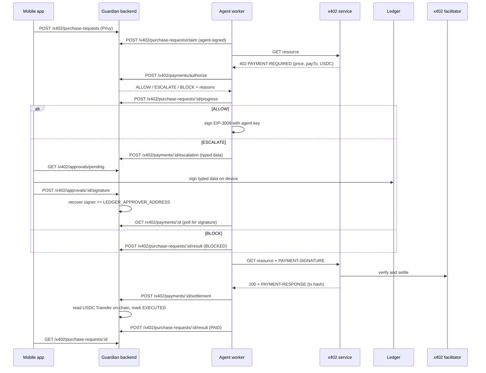

# Chapter 2: Architecture

Chapter 2 is the control layer for AI agents that spend money. An agent buys x402 services in USDC on its own, the **Guardian** decides every payment (**ALLOW / ESCALATE / BLOCK**), and humans approve anything big on a **Ledger**.

For the product overview see the [README](../README.md). For setup see [development.md](development.md).

## 1. Two layers

| | Management layer (humans) | Agent layer (the AI agent) |
|---|---|---|
| **Who** | Company operator / approver | Autonomous agent worker |
| **Runs on** | Phone ([`chapter2/`](../chapter2)), Guardian backend ([`backend/`](../backend)), Ledger device, web console ([`approval-console/`](../approval-console)) | The agent's machine ([`scripts/`](../scripts)) |
| **Identity** | Privy login with an embedded EVM wallet; Ledger approver address | Agent wallet whose key is protected by the Ledger Key Ring |
| **Does** | Binds the agent, picks services, approves or rejects escalations, sees activity | Claims purchase requests, asks the Guardian, pays x402 services, reports settlement |
| **Never holds** | The agent's key | The approver's key |

## 2. Components

### Mobile app (`chapter2/`, Flutter)
- **Auth:** Privy Google sign-in; the Privy token is sent as a Bearer token.
- **Onboarding:** welcome, bind the agent address, connect the Ledger approver.
- **Home:** agent, pending Ledger approvals, recent activity.
- **Services:** the Bazaar catalog with local search, service details, **Ask agent to pay**, and purchase status tracking.
- **Approvals:** Ledger over Bluetooth. The app signs EIP-712 in hashed mode to approve and `personal_sign` to reject.
- **Activity and Settings.**

Feature docs: [mobile-services-tab.md](features/mobile-services-tab.md), [mobile-ledger-bluetooth-approvals.md](features/mobile-ledger-bluetooth-approvals.md), [mobile-ui-and-onboarding.md](features/mobile-ui-and-onboarding.md).

### Guardian backend (`backend/`, NestJS on Render)

| Module | Responsibility |
|---|---|
| `x402/` | Paid resources behind x402 v2 middleware; the Guardian spending policy; the payments API (authorize, escalation, settlement); the approvals API; purchase requests; `AgentSignatureGuard` |
| `vendor/` | Bazaar discovery: `GET /discovery/resources` and `/discovery/search` |
| `auth/` | Privy token verification, user sync, account deletion, `PrivyAuthGuard` |
| `agents/` | Agent binding: reactivation, conflict checks, ownership checks |
| `world/` | World ID Selfie Check verification and human binding (not enforced on approvals yet) |
| `blockchain/` | `OnChainExecutorService`, **read-only**: settlement verification, contract reads, balances |
| `database/` | Postgres on Render with an in-memory mirror (file persistence in tests) |
| `gateway/` | WebSocket events for action lifecycle |
| `actions/`, `policies/`, `guardian/`, `crypto/`, `ledger/` | Original Safe / `Chapter2Guard` path. Kept, but never broadcasts |

### Agent worker (`scripts/`, Node)
- **`agent-worker.ts`:** polls for purchase requests and pays them through the Guardian-gated flow.
- **`agent-x402-client.ts`:** the scripted ALLOW / ESCALATE / BLOCK demo.
- **Key sources** (`AGENT_KEY_SOURCE`, no default):
  - `ledger-key-ring`: `wallet-cli ring decrypt`, in memory only;
  - `foundry-keystore`: for testing without a Ledger.
- **`lib/ledger-remote-signer.ts`:** for escalations, submits the typed data and waits for the Ledger signature.

### Ledger
- **Key Ring:** protects the agent key on the agent machine.
- **Approval signing:** Nano X / Flex, through the app over Bluetooth or the web console over WebHID.

Partner page: [docs/partners/ledger](partners/ledger).

### External services
- **x402.org facilitator:** verifies and settles EIP-3009 USDC authorizations on Base Sepolia and pays the gas.
- **Base Sepolia USDC:** `0x036CbD53842c5426634e7929541eC2318f3dCF7e`.
- **Privy:** authentication and embedded wallets ([docs/partners/privy](partners/privy)).
- **World:** World ID verification API ([docs/partners/world](partners/world)).

## 3. Purchase flow

**Purchase request states:** `QUEUED` → `PROCESSING` → `AUTHORIZED` → `PAID`, or a terminal `BLOCKED` / `REJECTED` / `EXPIRED` / `FAILED`. A request can only become `PAID` when the backend's own `TreasuryAction` is `EXECUTED` with a matching transaction hash.

## 4. Trust boundaries

1. **The backend holds no signing keys.** `OnChainExecutorService` is read-only, so the backend can't move funds.
2. **The agent key never leaves the agent machine.** Only the agent's own signature authenticates the agent's requests (`AgentSignatureGuard`: timestamped, single-use).
3. **Only the Ledger approves escalations.** Typed data is checked against the Guardian's record before approval, and an approval is accepted only if it recovers to `LEDGER_APPROVER_ADDRESS` and hasn't expired.
4. **The Guardian decides before any payment signature exists.** Deterministic rules (network, asset, approved payee, per-payment and daily limits) come first. A semantic risk pass can only escalate, never allow.
5. **Settlement is verified on-chain,** by reading the USDC `Transfer` log from the transaction receipt.
6. **Users only see their own data.** Privy identity scopes agents and purchase requests.

**Designed, not yet enforced:**
- **World ID approval gate:** see [world-id-approval-gate.md](world-id-approval-gate.md).
- **Signed agent-binding challenge:** binding an agent doesn't yet prove key control.

## 5. API map

| Access | Routes |
|---|---|
| Public | `GET /discovery/resources`, `GET /discovery/search`, `GET /x402/approvals/config`, `GET /x402/approvals/pending` |
| Paid (x402) | `GET /x402/weather`, `GET /x402/chain-report`, `GET /x402/partner-feed` |
| Ledger-signed | `POST /x402/approvals/:id/signature`, `POST /x402/approvals/:id/reject` |
| Privy (user) | `POST /auth/login`, `GET /auth/me`, `DELETE /auth/account`, `POST /agents/bind`, `GET /agents`, `POST /x402/purchase-requests`, `GET /x402/purchase-requests`, `GET /x402/purchase-requests/:id`, `/world/selfie/*` |
| Agent-signed | `POST /x402/payments/authorize`, `POST /x402/payments/:id/escalation`, `GET /x402/payments/:id`, `POST /x402/payments/:id/settlement`, `POST /x402/purchase-requests/claim`, `POST /x402/purchase-requests/:id/progress`, `POST /x402/purchase-requests/:id/result` |
| Legacy | `/actions/*`, `/vendor/*`, `/mandates/*`, `/ledger/*` |

## 6. Data model (key tables)

| Table | Holds |
|---|---|
| `user` | Privy user (id, email, embedded wallet), soft delete |
| `agent` | Bound agent address, owner, status (`ACTIVE` / `INACTIVE`) |
| `treasury_actions` | Every Guardian-evaluated payment (x402 actions are prefixed `x402:`) |
| `x402_escalations` | Typed data awaiting a Ledger signature, policy reasons, signature, status |
| `x402_purchase_requests` | App-to-agent purchase requests, their status, action, tx hash, response |
| `x402_payment_receipts` | Redeemed receipts for the legacy `/vendor` rail |
| `human_bindings` | World ID nullifier to signer address bindings, with expiry |

## 7. Deployment

- **Backend:** Render web service, root directory `backend`.
  - Build: `npm install && npm run build`. The build runs with a 460 MB Node heap.
  - Start: `npm run start:prod`.
  - Required x402 environment is listed in [development.md](development.md).
- **Network:** Base Sepolia (chain 84532). Payments are settled by `https://x402.org/facilitator`.
- **Legacy contracts:** `Chapter2Guard` `0x9b6023D1B6D3b076C8d999Ba406AE486750ce7d3` and MockSafe `0x4f712dd78Cb1a504C69CB4f68B82Fddb6b3b1df6`. The backend only reads them; the Guard's former owner key was exposed and is burned.
- **Mobile:** the Flutter app defaults to `BACKEND_BASE_URL=https://chapter2-backend.onrender.com`.

## 8. Engineering rules

The binding rules live in [`AGENTS.md`](../AGENTS.md) and `.agents/rules/`:
- **Zero fallback:** no invented data, mock users, placeholder balances or fake hashes in runtime code.
- **Git staging:** explicit paths only.
- **Commits:** conventional commits with a scope.
- **Verification:** gates run per component.
- **Docs:** a feature doc for each feature.
