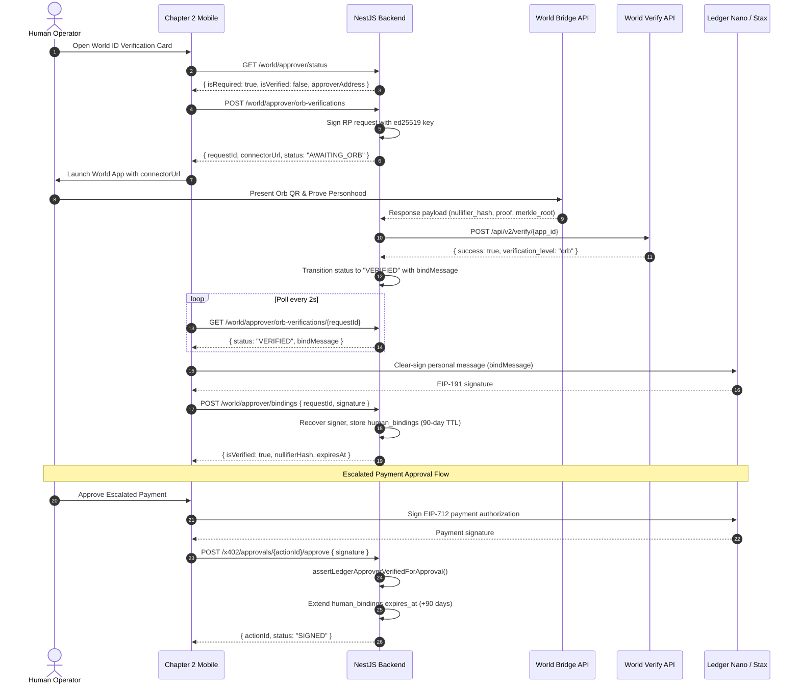

# Feature Documentation: World ID Orb-Verified Ledger Approver

## 1. Overview
The **World ID Orb-Verified Ledger Approver** subsystem binds the configured Ledger approver address to an Orb-verified human proof-of-personhood credential via World ID's Relying Party (RP) protocol. It enforces zero-fallback cryptographic personhood checks before escalated x402 payments can be authorized on-chain.

### Key Capabilities
1. **Relying Party Protocol Integration**:
   - Generates signed verification requests using `@worldcoin/idkit-core` with ed25519 signatures.
   - Polls World's Bridge API (`https://bridge.worldcoin.org/response/{requestId}`) until completion or 15-minute timeout.
   - Dispatches zero-knowledge proofs to World's Developer Portal verification endpoint (`https://developer.worldcoin.org/api/v2/verify/{app_id}`).
2. **Orb Credential Enforcement**:
   - Strictly enforces Orb-level biometric verification (`verification_level: 'orb'`).
   - Explicitly rejects weak device credentials (`'device'`).
3. **Cryptographic Ledger Signer Binding**:
   - Binds the verified nullifier hash to the configured Ledger approver address via EIP-191 personal message signature.
   - Prevents nullifier hijacking: each nullifier can only be bound to a single Ethereum signer address.
   - Requires verification and binding to be completed in the same user session within 15 minutes.
4. **Autonomous Payments Gate**:
   - Intercepts escalated x402 payment approvals (`POST /x402/approvals/:actionId/approve`).
   - Blocks unverified or expired approvers with HTTP `403 Forbidden`.
   - Bypasses gate when `REQUIRE_WORLD_ID_FOR_ESCALATIONS=false`.
   - Extends the 90-day inactivity window upon every successful clear-signed approval.
   - Allows rejection (`POST /x402/approvals/:actionId/reject`) without requiring World ID verification.
5. **Node.js WASM Compatibility**:
   - Provides an in-memory fetch shim that handles `file:` URLs for `idkit_wasm_bg.wasm` when loaded in CommonJS Node runtime.

---

## 2. Sequence Diagram



---

## 3. API Contract Reference

All endpoints are authenticated with `PrivyAuthGuard` (Bearer token).

### `GET /world/approver/status`
Returns the current personhood binding status of the configured Ledger approver address.
- **Response `200 OK`**:
  ```json
  {
    "approverAddress": "0x4f712dd78Cb1a504C69CB4f68B82Fddb6b3b1df6",
    "isRequired": true,
    "isConfigured": true,
    "isVerified": true,
    "nullifierHash": "0x12345678...",
    "boundAt": "2026-09-13T10:00:00.000Z",
    "expiresAt": "2026-12-12T10:00:00.000Z"
  }
  ```

### `POST /world/approver/orb-verifications`
Initiates an Orb verification session.
- **Response `201 Created`**:
  ```json
  {
    "requestId": "550e8400-e29b-41d4-a716-446655440000",
    "connectorUrl": "https://worldcoin.org/verify?t=...",
    "status": "AWAITING_ORB",
    "createdAt": "2026-09-13T10:00:00.000Z",
    "expiresAt": "2026-09-13T10:15:00.000Z"
  }
  ```
- **Error `503 Service Unavailable`**: Returned if World ID is not configured.

### `GET /world/approver/orb-verifications/:requestId`
Polls the verification session status.
- **Statuses**: `AWAITING_ORB` | `VERIFIED` | `FAILED` | `EXPIRED`
- **Response `200 OK`**:
  ```json
  {
    "requestId": "550e8400-e29b-41d4-a716-446655440000",
    "status": "VERIFIED",
    "bindMessage": "Chapter 2 Ledger Approver Binding\nSigner: 0x4f712dd78Cb1a504C69CB4f68B82Fddb6b3b1df6\nNullifier: 0x1234...\nRequest: 550e8400-...",
    "error": null,
    "createdAt": "2026-09-13T10:00:00.000Z",
    "expiresAt": "2026-09-13T10:15:00.000Z"
  }
  ```

### `POST /world/approver/bindings`
Binds the verified World ID session to the Ledger approver address.
- **Request Body**:
  ```json
  {
    "requestId": "550e8400-e29b-41d4-a716-446655440000",
    "signature": "0x..."
  }
  ```
- **Response `201 Created`**:
  ```json
  {
    "approverAddress": "0x4f712dd78Cb1a504C69CB4f68B82Fddb6b3b1df6",
    "isRequired": true,
    "isConfigured": true,
    "isVerified": true,
    "nullifierHash": "0x12345678...",
    "boundAt": "2026-09-13T10:00:00.000Z",
    "expiresAt": "2026-12-12T10:00:00.000Z"
  }
  ```
- **Errors**:
  - `400 Bad Request`: Malformed signature.
  - `401 Unauthorized`: Signature does not match configured Ledger approver address.
  - `404 Not Found`: Request does not exist or was initiated by another user.
  - `409 Conflict`: Verification is not `VERIFIED` or has expired.

---

## 4. WASM Loader Workaround in Node.js
`@worldcoin/idkit-core` imports `idkit_wasm_bg.wasm` via URL import (`new URL('idkit_wasm_bg.wasm', import.meta.url)`), which translates to a `file:` URL when running in Node.js CommonJS mode. Node's native `fetch` rejects `file:` URLs (`TypeError: Only HTTP(S) protocols are supported`).

To resolve this transparently:
- [idkit-node-wasm-loader.ts](file:///Users/godwinekainu/development/ethonline-2026/backend/src/world/idkit-node-wasm-loader.ts) patches `globalThis.fetch`.
- It intercepts any fetch requests targeting `file:` protocols ending with `/idkit_wasm_bg.wasm`.
- It reads the WASM binary synchronously via `fs.readFileSync(fileURLToPath(url))` and returns a standard `Response` object with `Content-Type: application/wasm`.
- All other URLs (`http:`, `https:`) delegate to the original `fetch`.

---

## 5. Anti-Sybil & Security Properties
1. **Nullifier Uniqueness**:
   - `human_bindings` table maintains unique constraints on both `signer_address` and `nullifier_hash`.
   - Stored and compared lowercased to prevent case-sensitivity bypasses.
   - If a nullifier is already bound to a different Ethereum address, subsequent binding attempts fail with explicit error.
2. **Session Isolation**:
   - Each verification session stores `userId` (Privy DID). Only the user who initiated the session can inspect or bind it.
3. **15-Minute Expiry**:
   - Incomplete verification sessions automatically transition to `EXPIRED` after 15 minutes.
4. **Credential Scope**:
   - The verified ZK proof must match `action` (e.g. `chapter2-ledger-approver`) and target `signal_hash`.
